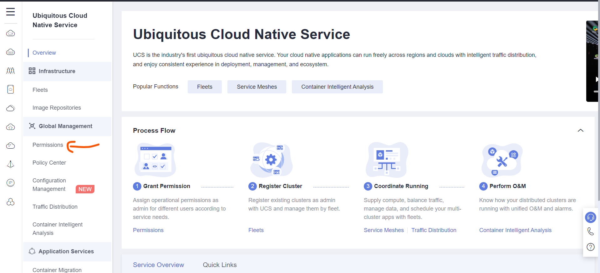

# ucs-workshop
UCS is running on [Karmada](https://karmada.io/docs/) which is a CNCF multi-cloud container orchestration project. The overall architecture of Karmada is shown as below:   


# Goals
* Build a multi-cluster management solution
* Explore the traffic distribution policies 

# Target audience
This is a technical workshop using two CCE cluster to simulate the situation where customers have multiple Kubernetes clusters on different cloud platform and on-premises. The participants should have experiences with Huawei Cloud and have basic knowledge of Kubernetes.

# Workshop Hands-on Environment


# Prerequisites
1. A Huawei Cloud Account
2. A public domain name(Must use a domain name that you have control over it unless you attend a workshop hosted by Professional Service team)
3. `git` and `Terraform` command tools have been installed on your laptop

# Tasks

## Create Access Keys
1. Log in to [Huawei Cloud](https://www.huaweicloud.com/intl/en-us/) with provided credential
2. Click account name on the upper right corner of the console, and choose `My Credentials`

3. Choose `Access Keys` on the left panel of the console and Click `Create Access Key`

4. Save the credential safely on your laptop

## Environment Variables Setup
Before running terraform to create resources on Huawei Cloud, you need to setup credential provider for Terraform, hard-coded credential with Terraform is not recommended, we encourage you to provide credential through environment variables.

Depending on what kind of operating system you are using, You can choose one of the following methods to configure environment variables on your laptop for Terraform.

Get the credential from [Create Access Keys](#create-access-keys) task.

### Linux/MacOS

```
export HW_ACCESS_KEY="anaccesskey"
export HW_SECRET_KEY="asecretkey"
export HW_REGION_NAME="ap-southeast-3"
```

### Windows CMD
```
setx HW_ACCESS_KEY "anaccesskey"
setx HW_SECRET_KEY "asecretkey"
setx HW_REGION_NAME "ap-southeast-3"
```

### Windows Powershell
```
$Env:HW_ACCESS_KEY="anaccesskey"
$Env:HW_SECRET_KEY="asecretkey"
$Env:HW_REGION_NAME="ap-southeast-3"
```

## Apply Terraform Configuration
1. Execute the following command to clone `ucs-workshop` repository to your laptop or ECS
```
git clone https://github.com/Huawei-APAC-Professional-Services/ucs-workshop.git
```

2. Change directory to `ucs-workshop/infra`
3. Apply Terraform Configuration  

:bulb: Local state file is used for this Terraform configuration, but you can change it to remote state as well.
```
Terraform apply
```
Wait for the Terraform to finish, two CCE clusters will be created in Singapore and Hong Kong region.

4. Save the output
When the terraform applying completes, you will get the following three outputs, save it for future use or you can query it by using `terraform ouput` command when the output is needed

* ecs_public_ip
* hk_elb_subnet_id
* singapore_elb_subnet_id 


After the terraform applying, there is a `ecs.pem` file inside the `infra` directory, it will be used to login to ECS.

5. Open `app.yaml` file with a text editor on your laptop
6. Move to line `72` and change the value of `kubernetes.io/elb.subnet-id` field to `singapore_elb_subnet_id`

7. Open `propagation.yaml` file with a text editor on your laptop
9. Move to line `81` and change the value of `kubernetes.io/elb.subnet-id` field to `hk_elb_subnet_id`

## Create UCS fleet
1. Log in to Huawei Cloud Console and Choose `Singapore` region using provided credential
2. On the upper left corner of the console, Choose `Service List` and search `ucs`

3. Choose `Ubiquitous Cloud Native Service`
4. On the left side panel of the console, Choose `Permissions` under `Global Management`

5. On the upper right corner of the console, Choose `Create Permission Policy` to allow current logged user `Admin` permission


6. On the upper right corner of the console, Choose `Fleets` under `Infrastructure` and Choose `Create Fleet` on the same page

7. When creating the fleet, only the `name` parameter is needed

8. On the `Fleets` page, Choose `Register Cluster`

9. On the `Register Cluster` page, provide the following parameters:
* Fleet: Choose the one you created in step 7
* Add Cluster: Choose the 2 CCE clusters created in [Apply Terraform Configuration](#apply-terraform-configuration) task
* Full Package: Don't choose, use `pay-per-use` billing model


10. On the `Fleets` page, at the right of the feet name, Choose `Enable` to enable unified orchestration of multiple clusters, cross-cluster auto scaling & service discovery, auto failover, etc.


11. It will take some time to enable the federation

12. Check UCS fleets status until the federation is enabled

13. Choose the fleet you just created.

14. On the `Feet Info` part of the page, Click `kubectl` to download kubeconfig file

15. On the pop-up page, provide the following parameters:
* project name: `ap-southeast-3`
* VPC: `ucs_singapore`
* Master Node Subnet: `ucs_singapore_cce_master`
* Validity Period: any value will do

Click `Download` to save `kubeconfig.json` in `ucs-workshop/infra` directory on your laptop


16. Copy the following code block to the Terraform resource `null_resource.ucs_file_copy_app_to_test_ecs` inside `ucs-workshop/infra/filecopy.tf` file
```
provisioner "file" {
  source      = "kubeconfig.json"
  destination = "/root/.kube/config"
}
```


17. Apply Terraform Configuration again to copy the file to ECS
```
Terraform apply
```

## Check Test Environment
1. Change directory to `ucs-workshop/infra`
2. If you don't have any ssh terminal installed on your laptop, you can use OpenSSH for Windows to log in to ECS, but first you may need to change the key permission when you are going to use OpenSSH for Windows, you can choose one of the two methods to change the key permission depends on which windows terminal you are using.

* Windows CMD
```
icacls ecs.pem /inheritance:r
icacls ecs.pem /grant:r "%username%":"(R)"
```
* Windows Powershell
```
icacls ecs.pem /inheritance:r
start-process "icacls.exe" -ArgumentList 'ecs.pem /grant:r "$env:USERNAME":"(R)"'
```

* Linux/MacOS  
```
chmod 400 ecs.pem
``` 

3. Log in to the ECS created in [Apply Terraform Configuration](#apply-terraform-configuration) with the following command on your terminal
```
ssh -i ecs.pem root@ecs_public_ip
```
4. Execute the following command to check if `kubectl` has been properly installed
```
kubectl version --client
```
5. Execute the following command to check if the kubeconfig is valid
```
kubectl get clusters
```
You will get the similar outputs like the following picture depicted


## Application Deployment
1. Log in to ECS and Change directory to `ucs-workshop/app`
2. Execute the following command to deploy application to UCS
```
kubectl apply -f app.yaml
```
3. Execute the following command to deploy application into two different clusters
```
kubectl apply -f propagation_policy.yaml
```
4. Execute the following command to check if the deployment is successful
```
kubectl get deployment
```


12. Log in to Huawei Cloud console and Choose the fleet you created earlier, then choose `Workloads` and `Services and Ingresses` to check if the application is deployed successfully, you should be able to see the status as the following pictures depicted.


## Create Public DNS Zones on Huawei Cloud  

**If you participates in a guided workshop, this step is not necessary, Please check with facilitators.** 

1. Log in to Huawei Cloud Console and Choose `Singapore` region using provided credential
2. On the upper left corner of the console, Choose `Service List` and search `dns`

3. Choose `Public Zones` from the left side panel and Choose `Create Public Zone` on the upper right corner of the console.
4. Provide a domain name that will be used on Huawei Cloud

:bulb: Before Huawei Cloud Domain Name Service can provide dns resolution publicly, you need to create a NS records on your domain name registrar with the following values
* ns1.huaweicloud-dns.com. 
* ns1.huaweicloud-dns.cn. 
* ns1.huaweicloud-dns.net. 
* ns1.huaweicloud-dns.org. 

## Create DNS Policy
1. Log in to Huawei Cloud Console and Choose `Singapore` region using provided credential
2. On the upper left corner of the console, Choose `Service List` and search `ucs`

3. Choose `Ubiquitous Cloud Native Service`
4. On the left side panel of the console, Choose `Fleets` under `Infrastructure`
5. Choose the fleet you created in [Create UCS fleet](#create-ucs-fleet) task
6. Choose `DNS Policies` under the `Federation` section and Choose `Create DNS Policy` on the upper right corner of the console

7. On the `Create DNS Policy`, Choose the `app-service` and click `Next: Access Mode`

8. Choose `Traffic Ratio` as `Active/Standby` and click `Create DNS Policy`

9. Back to `DNS Policies` page and click the policy you created in last step

10. Setup a alias for the service so it can be memorized easily


11. Access the application with the alias to check if the traffic policy is taking effect, the result should be able to tell where the response comes from.


12. Change the `Traffic Ratio` of the DNS policy to explore other options


# Design Discussion

1. **How do you think the multi-cluster management capabilities of UCS? Is it enough for your customers or do you think there is any improvement needed?**

2. **How do we integrate this multi-cluster application with HFA? Do we need a separate account? How does the traffic control works with the multi-cluster application?**

3. **Is there any alternative solution to UCS?**